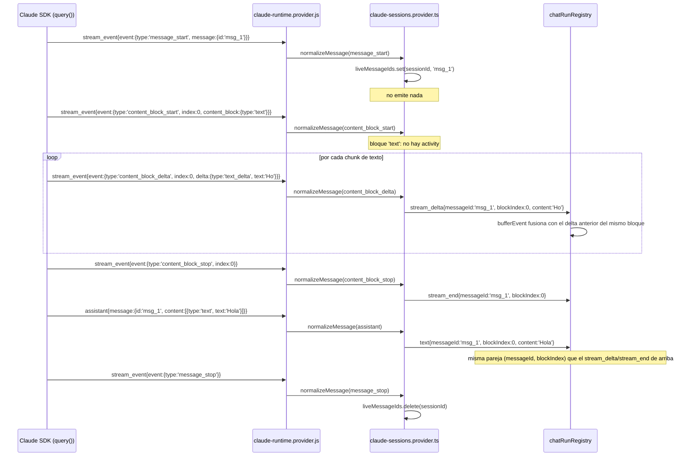

# El protocolo de streaming con identidad (Claude)

*El contrato de la Fase 4 del plan `05-octubre-revision-punta-a-punta.md`: qué evento sale
del normalizador de Claude por cada `stream_event` del SDK, con qué campos, en qué orden,
y cómo le queda a un cliente que todavía no los lee. Complementa
[la corriente en vivo](./02-realtime-stream.md), que describe el protocolo general de los
cuatro providers — este documento es solo la parte nueva: la identidad `(messageId,
blockIndex)` y los dos kinds que la llevan.*

## Por qué hace falta

`claude-sessions.provider.ts` ya traducía `content_block_delta`/`content_block_stop` a
`stream_delta`/`stream_end` desde el 23-sep (Fase 4 de *streaming en modo SDK*). Lo que no
llevaba ningún evento era una identidad: ni el `stream_delta` ni el `text` final decían a
qué mensaje ni a qué bloque de contenido pertenecían. La fila en streaming del cliente se
identificaba por un id sintético propio (`__streaming_<sessionId>`), no por nada que viniera
del wire — así que un broadcast que la pisara a mitad de turno (`recursos`,
`session_upserted`, `usage_window`) podía hacer que la fila se "remontara" visualmente, y el
pensamiento nunca llegaba incremental porque no había ningún evento de pensamiento en
absoluto. Ambos son el punto 1 de `e2e/evidencia/00-linea-base/lectura.md`.

Esta fase agrega la identidad y el pensamiento incremental sin tocar el cliente: todo lo
de abajo es nuevo, pero un cliente que ignora los campos nuevos sigue funcionando exactamente
como antes (Fase 5 es la que hace que el cliente los use).

## Los seis eventos del SDK, lo que emite cada uno

El SDK de Claude (`includePartialMessages: true`, ya prendido) envuelve cada evento crudo
de Anthropic en `{type:'stream_event', event, parent_tool_use_id, session_id}`.
`resolvePartialStreamEvent` (`claude-runtime.provider.js`) desenvuelve `event` y se lo pasa
al normalizador — salvo que `parent_tool_use_id` esté seteado (ver "Subagentes" más abajo).
El normalizador (`claude-sessions.provider.ts`, rama que arranca en el `if (raw.type ===
'message_start')`) lee el `event.type` desenvuelto:

| `event.type` (SDK) | Emite | Campos nuevos |
| --- | --- | --- |
| `message_start` | nada | — (solo guarda `message.id` en memoria) |
| `content_block_start` | `activity`, solo si el bloque es `thinking`/`redacted_thinking` o `tool_use` | `activityKind`, `toolName?`, `messageId`, `blockIndex` |
| `content_block_delta` con `delta.type==='text_delta'` | `stream_delta` | `messageId`, `blockIndex` |
| `content_block_delta` con `delta.type==='thinking_delta'` | `thinking_delta` | `messageId`, `blockIndex` |
| `content_block_delta`, cualquier otro `delta.type` (`input_json_delta`, `signature_delta`, `citations_delta`) | nada | — nada lee esos deltas todavía |
| `content_block_stop` | `stream_end` | `messageId`, `blockIndex` |
| `message_stop` | nada | — (limpia el `message.id` guardado) |

Y el mensaje completo — la fila `assistant` que llega al terminar el turno, tanto en vivo
como releída de un JSONL — lleva la misma pareja en sus partes `text` y `thinking`:

```ts
// claude-sessions.provider.ts, rama raw.message.role === 'assistant'
{ kind: 'text',     messageId: raw.message.id, blockIndex: partIndex, content: part.text }
{ kind: 'thinking',  messageId: raw.message.id, blockIndex: partIndex, content: part.thinking }
```

`raw.message.id` es el `message.id` de la API de Anthropic — **no** el `uuid` de la fila
JSONL, que es un id de transcript distinto y es el que ya usa el campo `id` del
`NormalizedMessage`. Un historial releído (no solo el live stream) también lo trae: está en
`message.id` de cada fila `assistant` del JSONL, así que recargar la página no pierde la
identidad.

## Los campos, en `NormalizedMessage` (`server/shared/types.ts`)

```ts
messageId?: string;            // el message.id de la API. Ausente si el provider no lo reporta.
blockIndex?: number;           // el índice de content_block dentro de ese mensaje.
activityKind?: 'thinking' | 'tool';  // solo en kind:'activity'.
parentToolUseId?: string;      // ya existía; activity es el único partial que lo cruza desde un subagente.
```

`(messageId, blockIndex)` es la clave por la que un cliente reemplaza una fila en vez de
agregarle otra: todo evento de un mismo bloque — sus deltas, su `stream_end`, y la fila
`text`/`thinking` final en la que resuelve — lleva la misma pareja. La Fase 5 es la que hace
que el cliente la use; hasta entonces el campo viaja sin consumidor, lo que es seguro porque
`NormalizedMessage` es un tipo abierto (`[key: string]: unknown`) y el cliente (`src/`) no
toca su propia copia del tipo en esta fase.

**Compatibilidad con otros providers.** `stream_delta`/`stream_end` ya existían como kinds
genéricos (Cursor y OpenCode los emiten; ver la tabla de "qué emite cada provider" en
[el documento de la corriente en vivo](./02-realtime-stream.md)). Ninguno de los dos manda
`messageId`/`blockIndex` hoy, y no hace falta que lo haga: los campos son opcionales, así que
un cliente que los lee cae al comportamiento de solo-agregar para esos providers. `codex`,
`cursor` y `opencode` no se tocaron en esta fase.

## `activity`: qué hace un bloque, no qué dice

`activity` es el único kind nuevo de los dos. Sale de `content_block_start`, y solo para dos
tipos de bloque:

- **`activityKind: 'thinking'`** — el modelo empezó a razonar. Sin `toolName`.
- **`activityKind: 'tool'`** — el modelo invocó una tool; `toolName` la nombra.

Un bloque `text` **no** levanta `activity`: su primer `stream_delta` ya es la señal de "el
texto arrancó", así que una `activity` ahí sería redundante.

### Subagentes: solo `activity` cruza, nunca su texto

Antes de esta fase, `resolvePartialStreamEvent` descartaba **todo** partial que llevara
`parent_tool_use_id` (el subagente que lo generó): el hilo principal nunca mostraba ni el
pensamiento ni el tipeo de un subagente en vivo, solo su resultado final al terminar — y ni
eso: sus deltas se perdían sin dejar ningún rastro de que algo estaba pasando mientras
corrían.

Ahora el único partial de un subagente que cruza es `content_block_start`: se normaliza
igual que el del hilo principal (una `activity` con `activityKind`/`toolName`), y
`parentToolUseId` se le adosa en `claude-runtime.provider.js` (el mismo mecanismo que ya
adosaba `parentToolUseId` a los mensajes completos del subagente). Sus
`content_block_delta`/`content_block_stop`/`message_start`/`message_stop` siguen
descartados — el hilo principal nunca stremea el texto ni el pensamiento de un subagente,
solo se entera de que está pensando o usando una tool. El texto completo de un subagente sí
llega, como ya llegaba: por la rama `assistant`/`thinking` normal, no por el streaming
parcial.

**Por qué la `activity` de un subagente no lleva `messageId`.** `liveMessageIds` (el mapa
que guarda el `message.id` en curso) está keyeado por `sessionId` de la app, y un
subagente corre bajo el mismo `sessionId` que el hilo principal — su propio
`message_start` nunca se procesa (queda descartado arriba), así que leer el mapa en su
`content_block_start` devolvería el `message.id` del hilo PRINCIPAL, no el suyo: un dato
falso, no uno faltante. `claude-runtime.provider.js` lo borra explícitamente en el punto
donde adosa `parentToolUseId}` antes de que la `activity` salga. La tarjeta que la consume
agrupa por `parentToolUseId`, no por `messageId`, así que no pierde nada que use hoy.

## El pensamiento incremental: por qué hacía falta `thinking: adaptive/summarized`

Pedir `includePartialMessages` no alcanza para que el `content_block_delta` de un bloque
`thinking` traiga texto: sin pedir explícitamente el modo de pensamiento, el bloque llega
con `thinking_delta` vacíos. `mapCliOptionsToSDK` ahora pide
`thinking: {type:'adaptive', display:'summarized'}` — la única configuración que
`servidor-code` (otro repo, el servicio de `:3100`) midió con `thinking_delta` no vacío en
su propia Fase 1 (23-sep, ver su plan de streaming) — cuando el modelo resuelto lo soporta.

**Esto es una aproximación, no la misma verificación que `servidor-code` hace.**
`servidor-code/server.mjs:851-854` lee la capacidad real del modelo desde el catálogo vivo
del SDK (`ModelInfo.supportsAdaptiveThinking`, vía su `fichaDe()`). Esta base de código tiene
la misma llamada — `queryInstance.supportedModels()` en `claude-models.provider.ts` — pero
está deshabilitada ahí mismo porque abre una sesión espuria, y de todos modos no se puede
invocar antes de construir las opciones (necesita una instancia de `query()` ya corriendo, y
las opciones se construyen antes de crearla). `modelSupportsAdaptiveThinking` en
`claude-runtime.provider.js` es un chequeo estático en su lugar: excluye `haiku` por nombre
de modelo, que es la única exclusión que `servidor-code` documentó (haiku reporta esa
capacidad como `undefined`). Todo lo demás —`default`, `best`, `fable`, `sonnet`, `opus` y
sus variantes— la pide. Medirlo con `consumo.py` antes/después, como pide el plan, no
aplica: ese script vive en el VPS (`servidor-code`), no en este repo.

## El tope de 5000 y la fusión de deltas en el buffer de replay

`chatRunRegistry` guarda hasta `MAX_BUFFERED_EVENTS_PER_RUN` (5000) eventos por run para que
un cliente que reconecta pueda pedir solo lo que se perdió (`chat.subscribe` con
`lastSeq`). Antes de esta fase, cada `stream_delta` — potencialmente uno por carácter en un
turno largo — ocupaba una entrada propia: un turno de pensamiento + texto largo podía gastar
el tope entero sin llegar siquiera al final del primer bloque, y un cliente que reconectaba
después caía a un refresh completo por REST en vez de un replay incremental.

`bufferEvent` (`chat-run-registry.service.ts`) ahora fusiona: si el evento que está por
guardarse es un `stream_delta`/`thinking_delta` y el último evento del buffer es del mismo
`kind` y el mismo `(messageId, blockIndex)`, no se agrega una entrada nueva — se concatena su
`content` a la entrada anterior y se le actualiza el `seq` al del evento nuevo. Dos cosas
importantes de esa fusión:

- **No afecta el envío en vivo.** Lo que `ChatSessionWriter.forward` manda a cada socket
  conectado es el mismo objeto `outbound` que `decorateAndRecordEvent` devuelve — eso pasa
  *antes* de que `bufferEvent` decida si lo fusiona en el buffer o no. Un cliente conectado
  en vivo sigue viendo cada delta por separado, con el tipeo carácter a carácter intacto.
- **El `seq` de la entrada fusionada es el del ÚLTIMO delta que absorbió, no el del
  primero.** `replayEvents` solo devuelve entradas cuyo `seq` es mayor que el `afterSeq` que
  pide el cliente — si la entrada fusionada se quedara con el `seq` del primer delta, un
  cliente que reconecta con un `afterSeq` intermedio (dentro del rango que esa entrada ya
  absorbió) no la recibiría y perdería el resto del bloque.
- **Sin `messageId` no hay fusión.** Un provider que no reporta `messageId` (la nota de
  compatibilidad de arriba) no tiene forma honesta de saber si dos deltas consecutivos son
  del mismo bloque o de dos bloques distintos con el mismo `blockIndex` — en ese caso cada
  delta sigue ocupando su propia entrada, como antes de esta fase.

## Diagrama: un bloque de texto, de principio a fin



## Dónde está cada pieza

| Archivo | Rol |
| --- | --- |
| `server/modules/providers/list/claude/claude-sessions.provider.ts` | `normalizeMessage`, rama `message_start`/`content_block_start`/`content_block_delta`/`content_block_stop`/`message_stop`. `liveMessageIds` es el `Map<sessionId, messageId>` que une los partials con el mensaje completo. |
| `server/modules/providers/list/claude/claude-runtime.provider.js` | `resolvePartialStreamEvent` (deja pasar el `content_block_start` de un subagente, nada más de él); el loop principal de `queryClaudeSDK` (borra el `messageId` espurio de una `activity` de subagente); `mapCliOptionsToSDK` (pide `thinking: adaptive/summarized`); `modelSupportsAdaptiveThinking`. |
| `server/modules/websocket/services/chat-run-registry.service.ts` | `bufferEvent` — la fusión de deltas consecutivos en el buffer de replay. |
| `server/shared/types.ts` | `MessageKind` (`thinking_delta`, `activity` nuevos) y los campos `messageId`/`blockIndex`/`activityKind`/`parentToolUseId` en `NormalizedMessage`. |
| `server/modules/providers/tests/claude-stream-event.test.ts` | Los tests de esta fase: identidad de mensaje, `activity` por tipo de bloque, subagentes, `thinking`. |
| `server/modules/websocket/tests/chat-run-registry.test.ts` | Los tests de la fusión del buffer de replay. |
| `e2e/fixtures/turnos/completo.jsonl` | Los `stream_event` crudos de un turno con texto, pensamiento, tool y subagente — sintéticos (ver su primera línea), porque este entorno no tiene token para grabar uno real. |
| `e2e/claude-falso.mjs` | El CLI falso: ahora emite `message_start`/`content_block_start`/`content_block_stop` con ids además de los `content_block_delta` que ya emitía. |

## Lo que esta fase no hizo

- **El cliente (`src/`) no lee nada de esto todavía.** Sigue identificando su fila en
  streaming por el id sintético `__streaming_<sessionId>`, no por `(messageId,
  blockIndex)`. Es la Fase 5 del plan.
- **`input_json_delta` (el input de una tool streameado carácter a carácter) no se expone.**
  El `tool_use` sigue llegando completo, al final, como antes.
- **El chequeo de `supportsAdaptiveThinking` es estático**, no la llamada en vivo al SDK —
  ver la sección de pensamiento incremental arriba.
- **`activity` no lleva `messageId` para un subagente**, por la razón explicada en esa
  sección — no hace falta hoy porque nada la consume por `messageId`.
